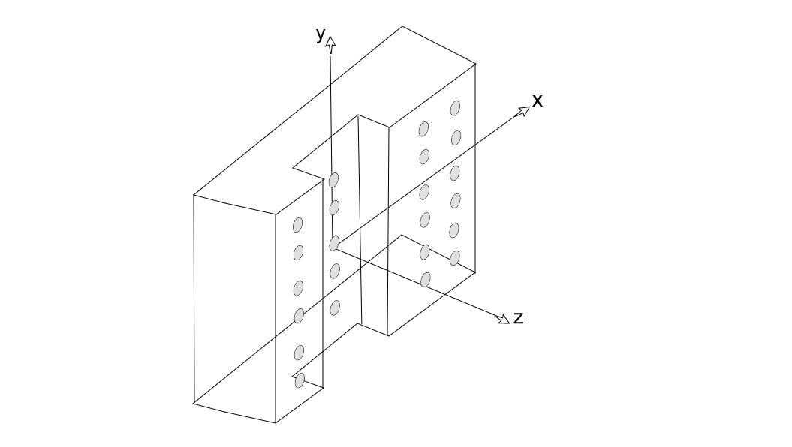

# Example of a calibration with two-sided target and 4 cameras

An example of the workaround to calibrate a non-transparent two-sided target using 4 cameras (or two pairs of cameras, on each side), provided by Shyam Kumar .M from the Indian Institute Of Technology Madras (shyamkuttamath at gmail dot com) and calibrated by [Alex Liberzon](http://alexlib.github.io)

## The setup

## How to calibrate
1. Learn the basics. The coordinate system defined in OpenPTV is a right-hand coordinate system attached to a calibration body, e.g. 

2. The two cameras in the present setup are on positive `z` side, and to others are on a negative `z` side, we need to remember this part when we adjust their orientation files, `cam1.tif.ori`
3. There is a better tool for calibration of this case, called PBI, it's a PyQt based GUI written by Yosef Meller @yosefm using the OpenPTV library and Python bindings [OpenPTV](http://github.com/openptv/openptv). The PBI is accessible here: [link](https://github.com/yosefm/pbi) and you need specifically the `cam_calib.py`. The main difference from the tool I will describe here, named PyPTV or OpenPTV-Python is that PBI calibrates each camera separately and provides to each camera its own list of target points (those dots on a calibration body), while PyPTV uses a single target file for the given set of parameters. Therefore, what I present here is a workaround this limitation, using PyPTV option to create multiple sets of parameters in the same folder. 

4. We basically create an experimental case with two pairs of cameras, each for each side of a calibration target and for each pair we create its own list of target points in its own target file. 

5. For the final test we combine back the 4 cameras in a single set of parameters and check if the orientation really works, i.e. we have correspondences. 

